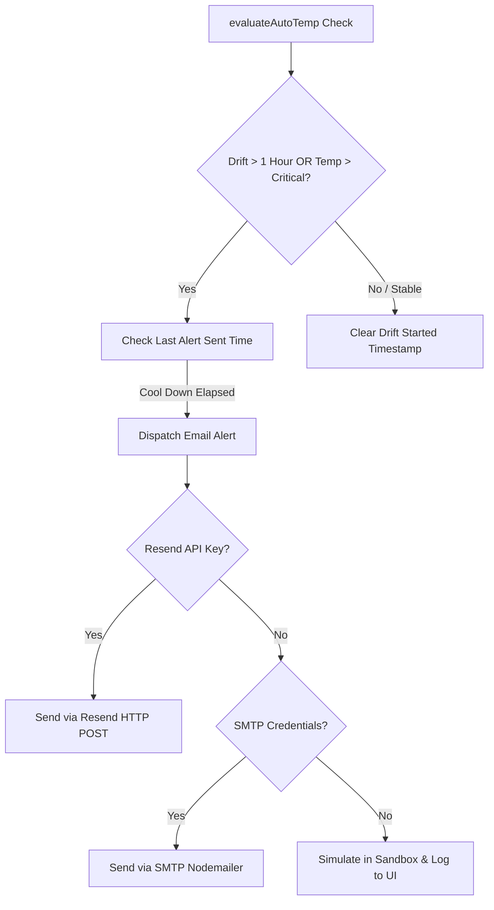

# Alert Configuration & Email Notification System Implementation Plan

We will add a robust Temperature Email Alert System to the **Automation** environmental loop. If the temperature drifts outside the target range ($\pm 1^\circ\text{C}$) for more than 1 hour, or if it exceeds a critical high threshold (e.g. $28^\circ\text{C}$), the system will automatically send an email alert to your configured address.

## User Review Required

> [!IMPORTANT]
> - **SMS Removed:** As requested, texting/SMS has been completely removed from this feature.
> - **Email Configurations:** To send actual emails, you will need to add either a **Resend API Key** or standard **SMTP Credentials** in your `.env.local` file (see guide below).
> - **Sandbox Mock Mode:** If no keys are configured in your `.env.local`, the system will gracefully operate in **Sandbox Mock Mode**, printing the simulated emails to the console and adding highlighted warning entries in the scrollable UI activity logs!

### Email Dispatch Setup Options in `.env.local`

You can choose either option. **Resend (Option 1)** is highly recommended for its 100% free tier and effortless single-key setup.

#### Option 1: Resend API Key (Recommended)
```env
RESEND_API_KEY="re_your_api_key_here"
```

#### Option 2: SMTP Mail Server
```env
SMTP_HOST="smtp.gmail.com"
SMTP_PORT="465"
SMTP_USER="your-email@gmail.com"
SMTP_PASS="your-gmail-app-password"
SMTP_FROM="Roofresh Automation <your-email@gmail.com>"
```

---

## Proposed Changes

We will extend the state store schema, add the email dispatcher utility, expose an API endpoint to update the alert email, and build a beautiful alert configuration drawer/modal.



### Core Logic & State Store

#### [MODIFY] [autoTempStore.ts](file:///d:/3.%20Work/1.%20Roofresh%20startup/Antigravity%20Project/src/lib/autoTempStore.ts)
Update the store to manage contact coordinates, critical levels, and drift tracking timers:

- Extend `AutoTempState` schema:
  - `alertEmail`: string (target email)
  - `criticalHighTemp`: number (default: `28`°C)
  - `driftStartedAt`: string | null (ISO timestamp when drift first occurred)
  - `lastAlertSentAt`: string | null (ISO timestamp to enforce a 2-hour alert cool-down and avoid spamming)
- Update `evaluateAutoTemp`:
  - If drift is active ($|T_{current} - T_{target}| > 1$), check if `driftStartedAt` is null. If yes, set `driftStartedAt = new Date().toISOString()`.
  - Compare `driftStartedAt` to current time. If difference $\ge$ 60 minutes, trigger `sendEmailAlert(containerId, 'drift', currentTemp)`.
  - If $T_{current} \ge \text{criticalHighTemp}$, trigger `sendEmailAlert(containerId, 'critical', currentTemp)` immediately.
  - If in stable range, reset `driftStartedAt = null`.

#### [NEW] [alerts.ts](file:///d:/3.%20Work/1.%20Roofresh%20startup/Antigravity%20Project/src/lib/alerts.ts)
Create a server-side notification helper to dispatch emails:
- **Resend:** Makes a simple native `fetch` HTTP request to `https://api.resend.com/emails`.
- **SMTP:** Fallback that sends email using standard nodemailer, if nodemailer is installed, or logs simulated email.
- **Sandbox Log:** Always appends an entry to the store log to confirm the alert went out.

---

### Backend API Updates

#### [MODIFY] [route.ts](file:///d:/3.%20Work/1.%20Roofresh%20startup/Antigravity%20Project/src/app/api/auto-temp/route.ts)
Allow the POST request body to dynamically save alert configurations (`alertEmail`, `criticalHighTemp`).

---

### Frontend UI & Layout

#### [MODIFY] [page.tsx](file:///d:/3.%20Work/1.%20Roofresh%20startup/Antigravity%20Project/src/app/containers/[id]/auto-temp/page.tsx)
Integrate the notification settings and a beautiful configuration modal:
- **Alert Panel Button:** Insert a gorgeous **`🔔 Configure Email Alerts`** button in the top status bar.
- **Modal Component:** Add a sleek, glassmorphic floating modal to configure alert preferences:
  - Input field for target email address.
  - Slider/Input for critical high temperature threshold.
  - Save button with immediate validation feedback.
- **Visual Cues:** Highlight alert event logs in bright warning red in the activity feed.

---

## Verification Plan

### Automated/Manual Sandbox Verification
1. We will verify TypeScript compilation and next build.
2. We will test the API endpoint locally to ensure alert email addresses are saved persistently.
3. We will simulate a critical drift/critical high temperature state locally using a fast manual test to verify that the email notifications trigger exactly as designed, writing detailed confirmation entries to the Activity Logs.
