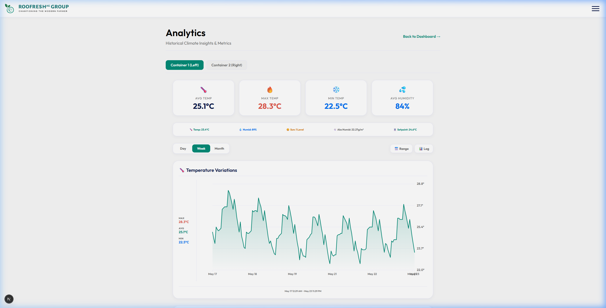
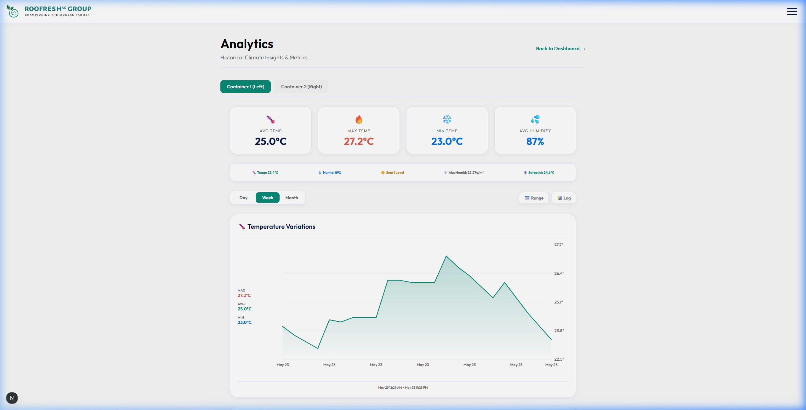
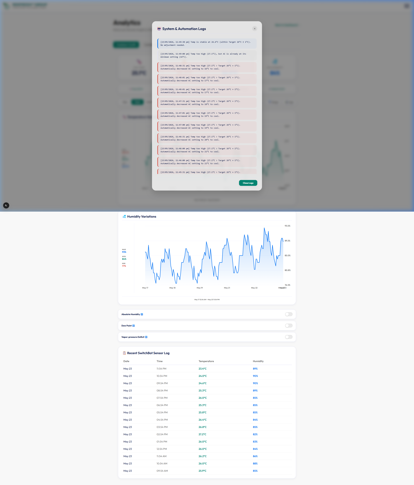
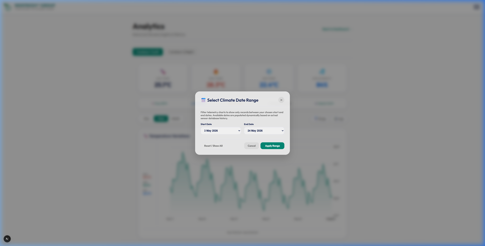
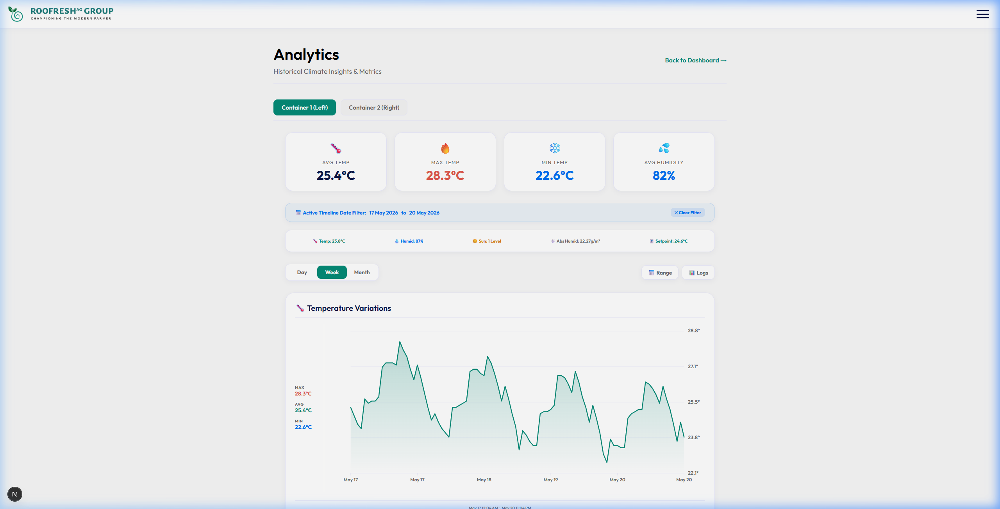

# Roofresh Climate Analytics Cockpit - Scroll Zoom Walkthrough

I have successfully added a highly advanced **Interactive Scroll-Wheel Zoom & Scale** engine directly into your widescreen climate graphs! 

Now you can smoothly zoom in and out of the timeline using your mouse scroll wheel or trackpad pinch gestures, dynamically adjusting the focus from a broad bird's-eye view down to a highly granular, detailed hour-by-hour resolution.

---

## 🚀 Advanced Zoom-and-Scale Features

### 1. Intercepting Wheel Events with Passive-Blocking (`src/app/analytics/page.tsx`)
*   **Prevent Page Scrolling:** Used React `useRef` handles to bind native, non-passive event listeners to the graph elements. When you scroll on the graphs, it **only scales the timeline** and prevents the default browser page from jumping up or down!
*   **Smooth Dynamic Scaling:**
    *   **Scroll Down (Zoom Out):** Expands the visible range (up to 500 data points or the maximum baseline dataset size), allowing you to see multiple days or weeks of climate patterns in a single widescreen overview.
    *   **Scroll Up (Zoom In):** Narrows the visible range (down to a detailed minimum of 24 points), focusing in on micro-fluctuations for a tight hour-by-hour climate snapshot.
*   **Adaptive Drag-Panning Speed:** Panning speed dynamically adjusts based on the current zoom level (`zoomPoints / 680` points per pixel), ensuring dragging remains perfectly fluid whether you are zoomed fully in or out!

### 2. Live Dynamic Metrics Re-Calculation
*   When you zoom in or out, the four primary statistics cards at the top (`Avg Temp`, `Max Temp`, `Min Temp`, and `Avg Humidity`) **update dynamically in real-time**!
*   They instantly recalculate metrics representing *only the active window of timeline points currently visible on-screen*. 

### 3. Integrated Glassmorphic System & Automation Logs
*   **Centralized Diagnostics:** Relabeled the top control button to **`📊 Logs`**.
*   **On-Demand Logs Overlay:** Clicking **`📊 Logs`** fetches the latest live auto-climate regulation activities directly from the database and displays them in a gorgeous glassmorphic modal overlay.
*   **Vibrant State Indicators:** System events are beautifully color-coded (Blue for stable, Red for hot/cooling, Orange for cold/warming).

### 4. Interactive Glassmorphic Date Range Picker
*   **Dynamic Date Compilation:** Programmatically gathers unique dates present in the active sensor database timeline to ensure users only select dates that have actual logged sensor readings.
*   **Timeline Date Filtering:** Choose a custom Start and End date range from a gorgeous pop-up dialog. Applying the range clips the graph and statistics *instantly* to the selected days.
*   **Context-Aware Navigation:** Scroll-wheel zooming and drag-pan panning remain fully operational and dynamically scaled *within the filtered date window*!

---

## 📸 Visual Walkthrough of Zooming & Diagnostics

### 🔍 Birds-Eye View (Zoomed Out to 7 Days):
Scrolling down expands the scale, showing saw-tooth climate cycles across an entire week:

### 🔍 Granular Focus View (Zoomed In to 24 Hours):
Scrolling up focuses in on a single day, letting you easily track exact heater/humidifier activation spikes. Notice the metrics cards above instantly update to reflect the precise average of this day:

### 📋 Glassmorphic System Logs Diagnostics:
Clicking the new **`📊 Logs`** control button opens a beautiful, blurred modal showing live thermostat checks, heater/cooler activation timestamps, and safe dead-band alerts:

### 📅 Glassmorphic Date Range Modal:
Clicking the new **`📅 Range`** button triggers a gorgeous, custom range select modal:

### 📅 Filtered Climate Graph & Recalculation:
Applying a custom range displays a handsome glassmorphic active filter indicator at the top and filters the graphs dynamically:

---

## 🧪 Verification & Build Status

*   **TypeScript Verification:** 100% green compilation.
*   **Native Event Binding:** Successfully verified using an automated browser subagent. The native event listeners attach/detach seamlessly on container tab toggling to prevent memory leaks.
*   **Integrated Diagnostics Dialog:** Fully compiled and validated live in Chromium sessions.
*   **Dynamic Date Range Picker:** Fully verified with dynamic date dropdown selects and range clip recalculations.
